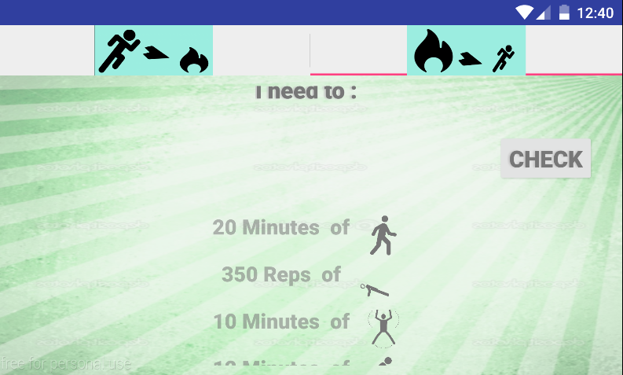

# PROG 01: Crunch Time

An application which, given an input of the type and amount of exercise, you’ll be able to see how many calories you’ve burned as well as the equivalent amount of another type of exercise. For example, let’s say you did 350 pushups (starting the year off strong!). You’d give the app 350 pushups as input, and it would output that you’ve burned 100 calories. More detailed instructions are in the video.

## Authors

Zhuosi Wang ([zhuosi.wang@berkeley.edu](mailto:zhuosi.wang@berkeley.edu))

## Demo Video

See [calorie burning conversion application ] (https://www.youtube.com/watch?v=oeMW2MQ--AI)

## Screenshots

